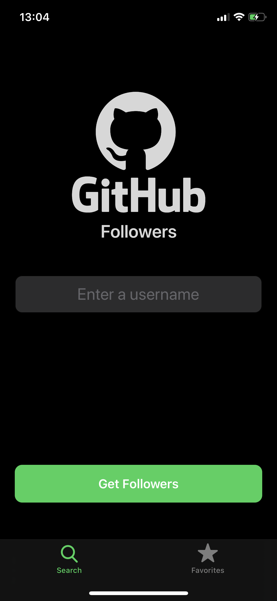
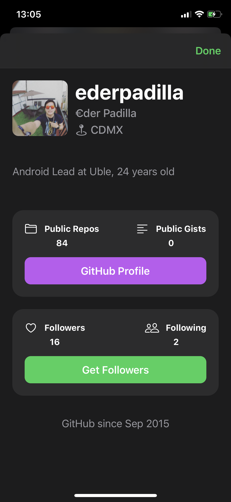
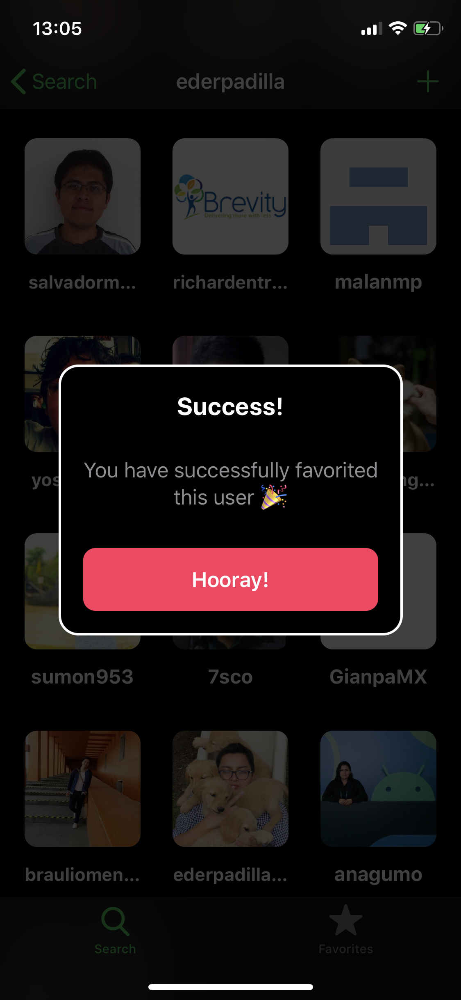

# iOS-Github-Followers 🚀

This repo its an iOS sample of consuming the GitHub API to get your followers, add to favorites, and show profile details
This repo will show how you can create a ***Tableview***, CollectionView, a lot of custome views by using **NO STORYBOARD 🎉**, also you have a little sample of cosuming GitHub Api.

&emsp;
&emsp;

# **Videos**

You can take the course with the sensei [Sean Allen](https://seanallen.teachable.com "Sean Allen")  
[Twitter ](https://twitter.com/ederpadilla97 "Twitter ")

